# Mnemosyne — the visual atlas

*Thirteen Mermaid diagrams covering the whole logic, the data flows, the components,
and the software choices at every stage. Each diagram also ships as a standalone
`.mermaid` file (rendered natively by the interface and most tooling). Sources are
embedded below so this document is self-contained and Roam/Logseq-pasteable.*

| # | Diagram | One-line scope |
|---|---|---|
| 01 | The whole logic in one frame | The three-layer Mnemosyne stack (RLM inference over an ActiveGraph-style event runtime over a datom-family immutable store), with the B-half judgment ladder feeding the consolidator, the propagation/emergence layer as a consumer-and-producer of the log, and software stamps at each station (DataScript for the working projection, Fluree as the target ledger, vLLM + judge_harness for the swarm). |
| 02 | The one pattern under everything | Every mechanism in the project is an instance of: a signal accumulates along the graph, crosses a threshold, and reifies a first-class provenanced node, which feeds back. |
| 03 | Data flow, cradle to flywheel | The four loops and how they hand off: calibration (offline, per judge version), the live judging loop (pre-filter to promotion to graph and back), the audit loop (anchor sampling to drift to quarantine to cohort retraction), and the distillation loop (provenance-gated dataset to QLoRA to shadow to the promote gate). |
| 04 | Lifecycles: judgment and judge | Two state machines. |
| 05 | One judgment, end to end | The wire-level story of a single edge-type judgment: per-label echo scoring against vLLM (shared prefix cached), temperature scaling and the conformal gate in the harness, the outbox append, idempotent tailing by the consolidator, anchor supremacy versus T2 panel arbitration, and the escalation round-trip. |
| 06 | The regime ladder and distillation gravity | Cheapest-regime-first with abstention upward (A heuristics, B classifiers, B-half small-LLM judges, C anchor) and the countercurrent flowing down: anchor traces distill into judges, stable judge behavior compiles into classifiers, stable patterns compile into rules. |
| 07 | Calibration and distillation, with the anti-collapse rails | From admissible sources (provenance-gated: human over double-pass anchor over anchor; equal-tier conflicts dropped) through the deterministic hash-bucket split (the audit set freezes itself), QLoRA on the 3090, McNemar-tested audit evaluation, shadow comparison, and the three-outcome promote gate. |
| 08 | Drift, quarantine, cohort retraction | The immune system: anchor sampling produces agreement facts; drift per (type x judge-version) triggers reversible quarantine; systematic bias triggers cohort retraction via the taint closure -- with nothing ever deleted, so the mistake remains queryable as-of any past time. |
| 09 | The data model (entity-relationship view) | The judgment layer's schema as deployed in judges. |
| 10 | Deployment topology and software choices | The physical system over the Tailscale mesh: prefill-heavy judging on Machine B's dual 3090s (vLLM with prefix caching; QLoRA runs there too), the third judge family and the runner on Machine A, the consolidator JVM on the Mac, and the NAS as the home of the ops/ JSONL exchange, the (planned) Fluree ledger, and Hermes services. |
| 11 | The Fluree hybrid L3 (the Athens split, instantiated) | DataScript stays the in-process working projection -- rules. |
| 12 | The CALM split (what distributes, what does not) | The architecture's standing discipline: the monotone core (appends, emissions, positive recursion, counters, pooled embeddings, reasoner materialization) is coordination-free across Hermes nodes; the non-monotone boundary (negation, promotion, stances, invalidation, retraction) belongs to the single-writer consolidator. |
| 13 | Build roadmap and current status | What is done (specs, substrate, contract, harness, calibration tooling, ops service, distillation -- self-tested where executable), what is next (first live edge_type judge on the real graph; wiring the dreamer surprisal pre-filter), and what follows (Fluree adapter, propositionizer, first distillation pass, belief layer live). |

## 01 · The whole logic in one frame

The three-layer Mnemosyne stack (RLM inference over an ActiveGraph-style event runtime over a datom-family immutable store), with the B-half judgment ladder feeding the consolidator, the propagation/emergence layer as a consumer-and-producer of the log, and software stamps at each station (DataScript for the working projection, Fluree as the target ledger, vLLM + judge_harness for the swarm). Companions: mnemosyne_stack.md, stack.svg.

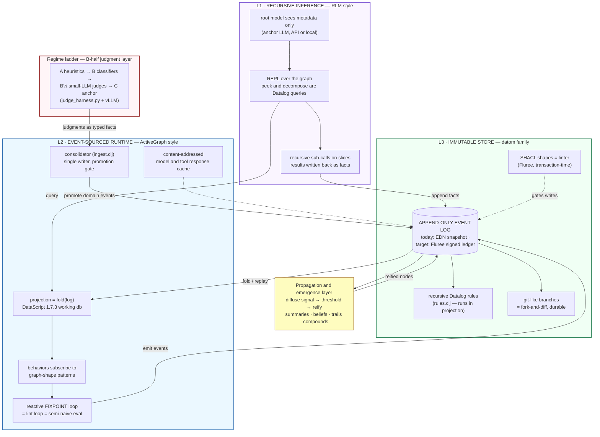

## 02 · The one pattern under everything

Every mechanism in the project is an instance of: a signal accumulates along the graph, crosses a threshold, and reifies a first-class provenanced node, which feeds back. Six instances span the granularity dial: propositions (down), canonical entities (lateral), compound entities/FCA (up), summaries (up), claims-with-stance (up), trails (meta).

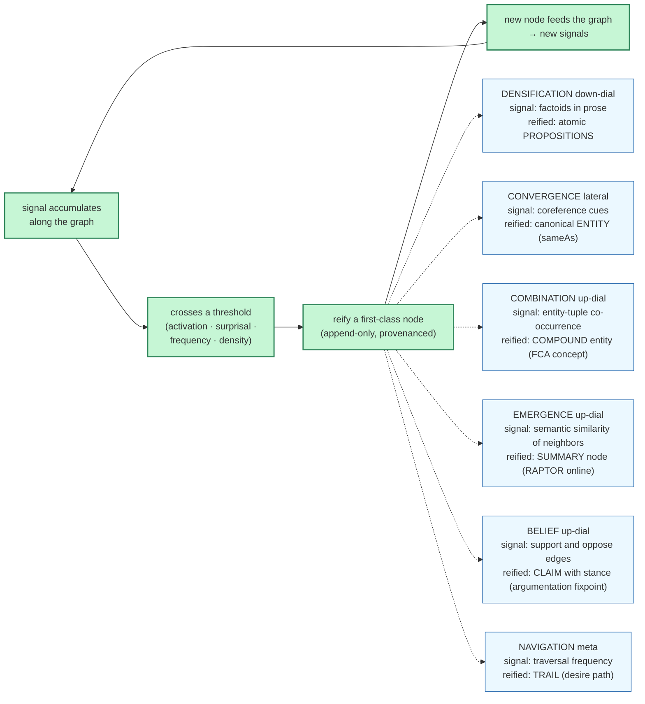

## 03 · Data flow, cradle to flywheel

The four loops and how they hand off: calibration (offline, per judge version), the live judging loop (pre-filter to promotion to graph and back), the audit loop (anchor sampling to drift to quarantine to cohort retraction), and the distillation loop (provenance-gated dataset to QLoRA to shadow to the promote gate). Every arrow corresponds to a JSONL file or a function in the delivered artifacts.

```mermaid
flowchart LR
  classDef off fill:#fefcbf,stroke:#975a16
  classDef live fill:#ebf8ff,stroke:#2b6cb0
  classDef aud fill:#fed7d7,stroke:#9b2c2c
  classDef dis fill:#faf5ff,stroke:#805ad5

  subgraph CAL["CALIBRATION — offline, once per judge version"]
    RX["Roam export JSON"] --> HV["roam_harvest.py<br/>7 candidate miners"]
    HV --> CD["candidates_{type}.jsonl"]
    CD --> AL["anchor_label.py --double<br/>salted orders, policy guidance"]
    AL --> CS["calset (FROZEN gold)"]
    AL --> RQ["review_queue.md"] --> HUM["human spot-check (T2)"] --> CS
    CS --> CB["judge_harness calibrate<br/>temperature fit + conformal q-hat"]
    CB --> CJ[("calibration.json")]
  end

  subgraph LIVE["LIVE LOOP — continuous"]
    PFX["pre-filter: activation ·<br/>surprisal (dreamer) · dirty-marks"] --> LC["live candidates"]
    LC --> JH["judge_harness judge ×3 families<br/>echo-score → scale → conformal gate"]
    CJ -.-> JH
    JH --> OB["ops/outbox.jsonl +<br/>contexts.jsonl (content-addressed)"]
    OB --> IN["ingest.clj — tail, idempotent,<br/>UTF-8 safe, offsets"]
    IN --> CO["consolidate: anchor supremacy →<br/>T2 panel k-of-n → promote"]
    CO --> DF["domain facts: discourse edges ·<br/>sameAs · stale-marks · tasks"]
    DF --> GR[("event log / graph<br/>belief fixpoint · summaries")]
    GR --> PFX
    CO --> ES["escalations.jsonl"] --> AP["anchor pass<br/>(judge --judge anchor)"] --> OB
  end

  subgraph AUD["AUDIT LOOP — daily"]
    GR --> AC["accepted.jsonl"] --> AS["anchor-sample rho=5%"]
    AS --> AO["anchor_outbox.jsonl"] --> IN
    IN --> DR["drift rate per type × judge-version"]
    DR -->|"over theta"| QU["quarantine judge"] --> CR["cohort retraction:<br/>taint closure → retract → recompute"]
    CR --> GR
  end

  subgraph DIS["DISTILLATION LOOP — per milestone"]
    CS --> DS["distill dataset:<br/>provenance gate · conflict resolve ·<br/>hash-bucket train vs frozen audit"]
    AC -->|"anchor rows only"| DS
    HUM --> DS
    DS --> TR["QLoRA train (3090,<br/>peft + trl + bitsandbytes)"]
    TR --> SH["shadow run + eval-audit<br/>(McNemar exact)"]
    SH --> PG{"promote-check"}
    PG -->|"PROMOTE"| JH
    PG -->|"EXTEND-SHADOW"| SH
    PG -->|"REJECT"| DS
  end

  class CAL off
  class LIVE live
  class AUD aud
  class DIS dis
```

## 04 · Lifecycles: judgment and judge

Two state machines. A judgment flows scored -> candidate/abstained -> accepted/rejected -> possibly retracted; a judge flows calibrating -> active -> quarantined/shadow -> retired-but-never-deleted. Promotion is the only non-monotone transition; everything else is an append.

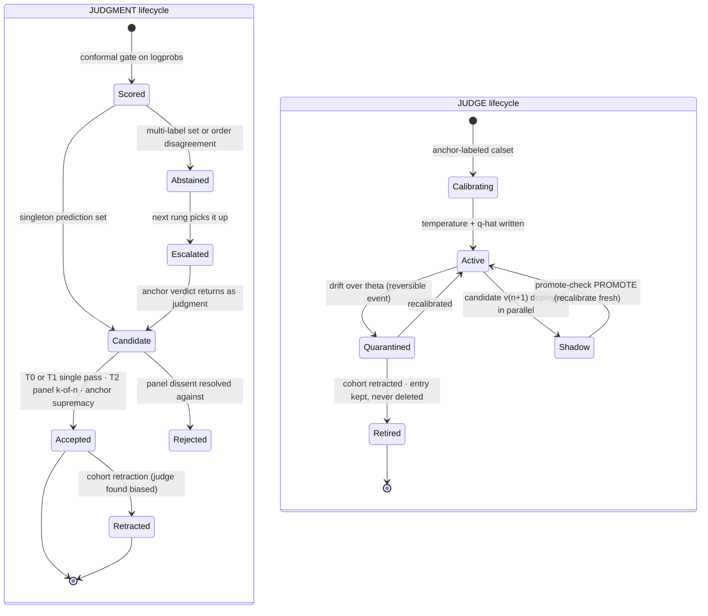

## 05 · One judgment, end to end

The wire-level story of a single edge-type judgment: per-label echo scoring against vLLM (shared prefix cached), temperature scaling and the conformal gate in the harness, the outbox append, idempotent tailing by the consolidator, anchor supremacy versus T2 panel arbitration, and the escalation round-trip.

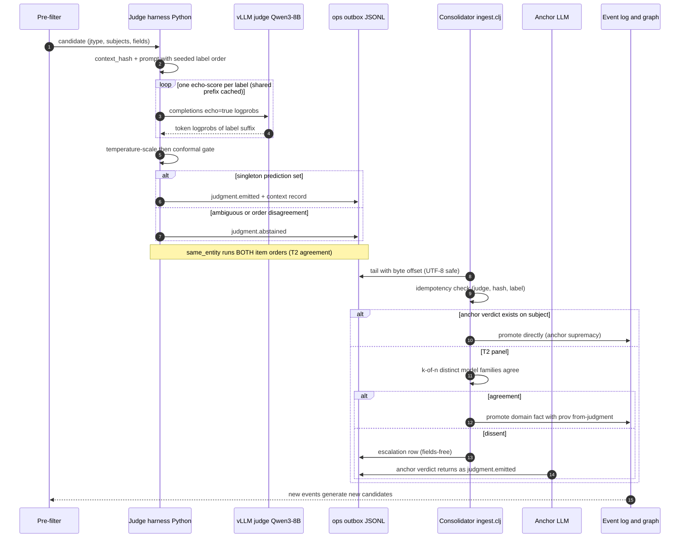

## 06 · The regime ladder and distillation gravity

Cheapest-regime-first with abstention upward (A heuristics, B classifiers, B-half small-LLM judges, C anchor) and the countercurrent flowing down: anchor traces distill into judges, stable judge behavior compiles into classifiers, stable patterns compile into rules. Self-improvement = re-pricing cognition downward.

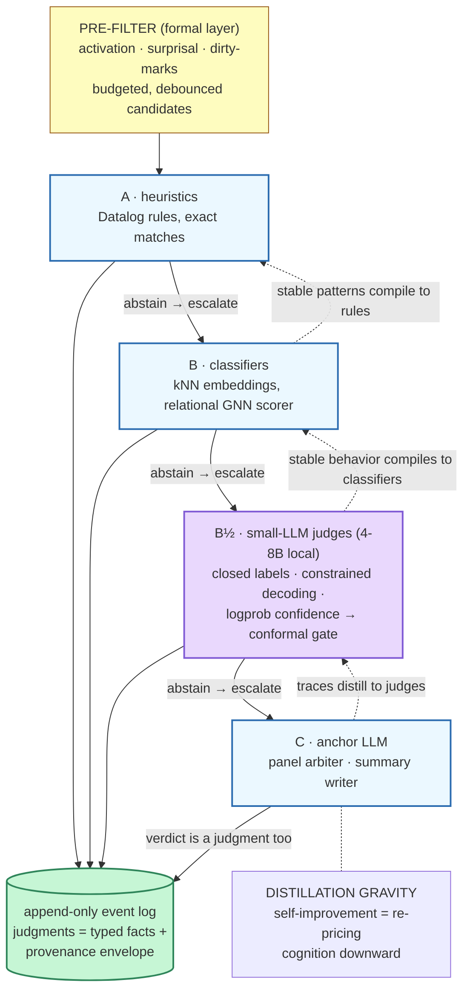

## 07 · Calibration and distillation, with the anti-collapse rails

From admissible sources (provenance-gated: human over double-pass anchor over anchor; equal-tier conflicts dropped) through the deterministic hash-bucket split (the audit set freezes itself), QLoRA on the 3090, McNemar-tested audit evaluation, shadow comparison, and the three-outcome promote gate.

```mermaid
flowchart LR
  classDef src fill:#fefcbf,stroke:#975a16
  classDef frozen fill:#fed7d7,stroke:#9b2c2c,stroke-width:2px
  classDef proc fill:#ebf8ff,stroke:#2b6cb0
  classDef gate fill:#e9d8fd,stroke:#805ad5,stroke-width:2px

  CS["anchor calsets<br/>(double-pass consistent)"]:::src
  AR["accepted.jsonl —<br/>anchor-family rows only"]:::src
  HG["human gold<br/>(worked review queues)"]:::src

  DS["dataset command<br/>provenance gate: human over anchor_double over anchor ·<br/>equal-tier conflicts DROPPED ·<br/>deterministic hash-bucket split"]:::proc
  CS --> DS
  AR --> DS
  HG --> DS

  TRN["train_{type}.jsonl<br/>SFT target imported from<br/>the deployed scorer"]:::proc
  AUD["audit_{type}.jsonl<br/>FROZEN — never trained on,<br/>membership fixed by hash rule"]:::frozen
  DS --> TRN
  DS --> AUD

  QL["QLoRA train on 3090<br/>peft + trl, assistant-only loss,<br/>r=16 nf4 4-bit"]:::proc
  TRN --> QL
  QL --> AD["adapter + weights hash<br/>→ new judge identity"]

  EV["eval-audit: paired argmax,<br/>McNemar exact on discordant pairs"]:::proc
  AUD --> EV
  AD --> SRV["vllm serve --enable-lora"] --> EV
  SRV --> SHW["shadow run on live candidates<br/>(separate outbox, never promoted)"]:::proc
  SHW --> SC["shadow-compare: agreement ·<br/>abstention band · anchor join"]:::proc

  PG{"promote-check gate"}:::gate
  EV --> PG
  SC --> PG
  PG -->|"PROMOTE: recalibrate fresh,<br/>family preserved, old judge quarantined"| FLEET["judge fleet"]
  PG -->|"EXTEND-SHADOW: gain real<br/>but p over 0.05 — gather more"| SHW
  PG -->|"REJECT"| DS
```

## 08 · Drift, quarantine, cohort retraction

The immune system: anchor sampling produces agreement facts; drift per (type x judge-version) triggers reversible quarantine; systematic bias triggers cohort retraction via the taint closure -- with nothing ever deleted, so the mistake remains queryable as-of any past time.

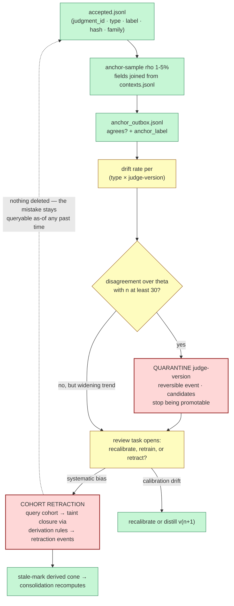

## 09 · The data model (entity-relationship view)

The judgment layer's schema as deployed in judges.clj and ingest.clj: judges emit judgments about nodes; accepted judgments license domain facts (prov_from_judgment is what makes cohort retraction a query); every assertion traces to an event; events chain causally; anchor checks attach to sampled judgments.

```mermaid
erDiagram
  JUDGE ||--o{ JUDGMENT : emits
  JUDGMENT }o--o{ NODE : about_subjects
  JUDGMENT ||--o{ DOMAIN_FACT : licenses
  EVENT ||--o{ NODE : asserts_prov
  EVENT ||--o{ DOMAIN_FACT : asserts_prov
  EVENT }o--|| EVENT : caused_by
  NODE ||--o{ EDGE : from
  NODE ||--o{ EDGE : to
  DOMAIN_FACT ||--o| EDGE : reifies
  JUDGMENT ||--o{ ANCHOR_CHECK : sampled_by
  NODE ||--o{ FLAG : flagged_by
  NODE ||--o{ TASK : opens

  JUDGE {
    string judge_id PK
    string model
    string family
    string weights_hash
    int prompt_version
    bool quarantined
  }
  JUDGMENT {
    string judgment_id PK
    string jtype
    string label
    float confidence
    string status
    string context_hash
    string cal_version
    string subjects_vec
  }
  EVENT {
    string event_id PK
    string event_type
    string actor
    string caused_by FK
    string timestamp
  }
  NODE {
    string node_id PK
    string node_type
    bool derived_stale
    bool prop_faithful
  }
  EDGE {
    string edge_type
    string from_node FK
    string to_node FK
  }
  DOMAIN_FACT {
    string node_id PK
    string prov_from_judgment FK
  }
  ANCHOR_CHECK {
    bool agrees
    string anchor_label
  }
  FLAG {
    string flag_kind
  }
  TASK {
    string status
    int depth
  }
```

## 10 · Deployment topology and software choices

The physical system over the Tailscale mesh: prefill-heavy judging on Machine B's dual 3090s (vLLM with prefix caching; QLoRA runs there too), the third judge family and the runner on Machine A, the consolidator JVM on the Mac, and the NAS as the home of the ops/ JSONL exchange, the (planned) Fluree ledger, and Hermes services.

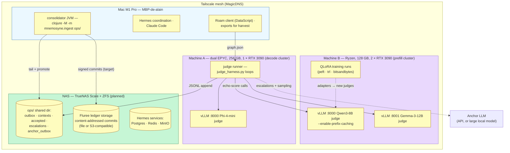

## 11 · The Fluree hybrid L3 (the Athens split, instantiated)

DataScript stays the in-process working projection -- rules.clj verbatim -- while Fluree becomes the durable, signed, branched, SHACL-gated ledger. Per-judge keypairs upgrade cohort retraction to non-repudiation; the reasoner materializes the monotone core; SPARQL/JSON-LD with ELI and PROV-O is the verifiable RGPD audit surface.

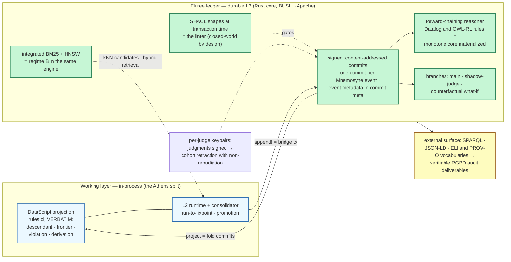

## 12 · The CALM split (what distributes, what does not)

The architecture's standing discipline: the monotone core (appends, emissions, positive recursion, counters, pooled embeddings, reasoner materialization) is coordination-free across Hermes nodes; the non-monotone boundary (negation, promotion, stances, invalidation, retraction) belongs to the single-writer consolidator. Decisions re-enter the log as appends -- monotone again.

```mermaid
flowchart LR
  classDef mono fill:#c6f6d5,stroke:#2f855a,stroke-width:2px
  classDef nonm fill:#fed7d7,stroke:#9b2c2c,stroke-width:2px

  subgraph M["MONOTONE CORE — coordination-free, runs on ANY Hermes node"]
    M1["append events · emit judgments"]:::mono
    M2["positive recursion:<br/>descendant · event-chain · derivation"]:::mono
    M3["trail counters · co-occurrence tallies"]:::mono
    M4["pooled embeddings (provisional)"]:::mono
    M5["Fluree reasoner materialization<br/>(positive rules only — enforced)"]:::mono
  end

  subgraph N["NON-MONOTONE BOUNDARY — single writer: the consolidator"]
    N1["negation: frontier · linter · SHACL"]:::nonm
    N2["promotion · panel arbitration ·<br/>sameAs acceptance"]:::nonm
    N3["belief stance — grounded extension"]:::nonm
    N4["re-summarization · invalidation"]:::nonm
    N5["retraction · cohort retraction"]:::nonm
  end

  M ==>|"stratification: monotone facts flow in,<br/>decisions flow back as new appends"| N
  N ==>|"every decision re-enters the log<br/>as an append (monotone again)"| M
```

## 13 · Build roadmap and current status

What is done (specs, substrate, contract, harness, calibration tooling, ops service, distillation -- self-tested where executable), what is next (first live edge_type judge on the real graph; wiring the dreamer surprisal pre-filter), and what follows (Fluree adapter, propositionizer, first distillation pass, belief layer live).

```mermaid
flowchart LR
  classDef done fill:#c6f6d5,stroke:#2f855a,stroke-width:2px
  classDef next fill:#fefcbf,stroke:#975a16,stroke-width:2px
  classDef later fill:#ebf8ff,stroke:#2b6cb0

  S1["1 · Substrate spec + reference impl<br/>mnemosyne.clj · rules.clj — DONE (hand-checked)"]:::done
  S2["2 · Judgment contract + Datalog layer<br/>microjudge_contract · judges.clj — DONE"]:::done
  S3["3 · Harness + prompts + schemas<br/>judge_harness · judge_prompts — DONE (self-tested)"]:::done
  S4["4 · Calibration loop<br/>roam_harvest · anchor_label — DONE (demo-run)"]:::done
  S5["5 · Ops service<br/>ingest.clj · runbooks — DONE (hand-checked)"]:::done
  S6["6 · Distillation pipeline<br/>distill_judge — DONE (self-tested)"]:::done
  N1["7 · FIRST LIVE JUDGE: harvest real graph →<br/>anchor-label edge_type → review →<br/>calibrate qwen-a → watch abstention rate"]:::next
  N2["8 · Pre-filter wiring:<br/>dreamer surprisal → candidates"]:::next
  L1["9 · Fluree L3 adapter:<br/>signed commits · SHACL port · branches"]:::later
  L2["10 · Propositionizer pipeline →<br/>faithful calset top-up"]:::later
  L3["11 · First distillation pass<br/>(at ~1k admissible examples)"]:::later
  L4["12 · Belief layer live:<br/>grounded-extension fixpoint over<br/>promoted discourse edges"]:::later

  S1 --> S2 --> S3 --> S4 --> S5 --> S6 --> N1 --> N2 --> L1
  N1 --> L2
  N2 --> L3
  L1 --> L4
```

---
*Provenance: synthesized from the project artifacts (mnemosyne_stack.md,
microjudge_contract.md, the README set, and the code) as of 2026-06-11.
Diagram sources are the single source of truth; this compendium is generated from them.*