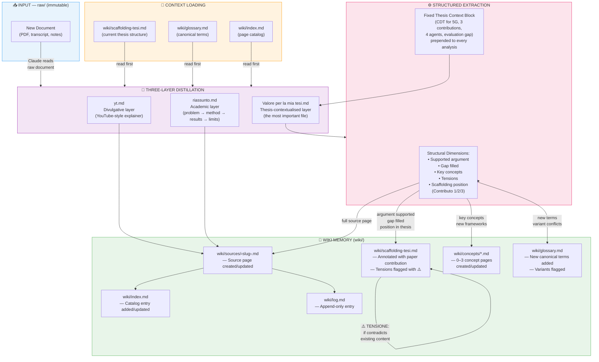
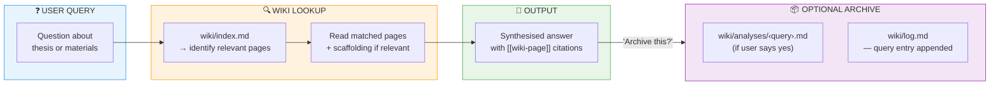
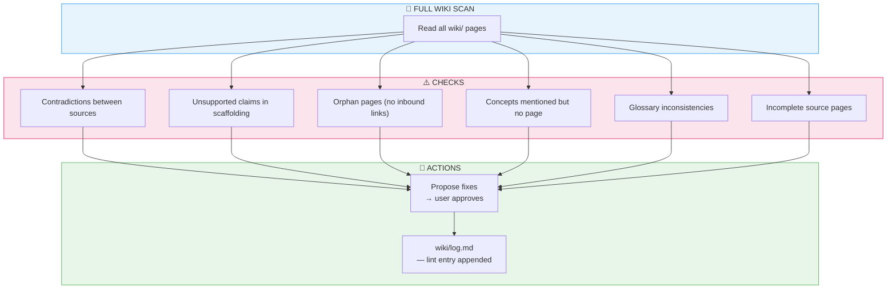
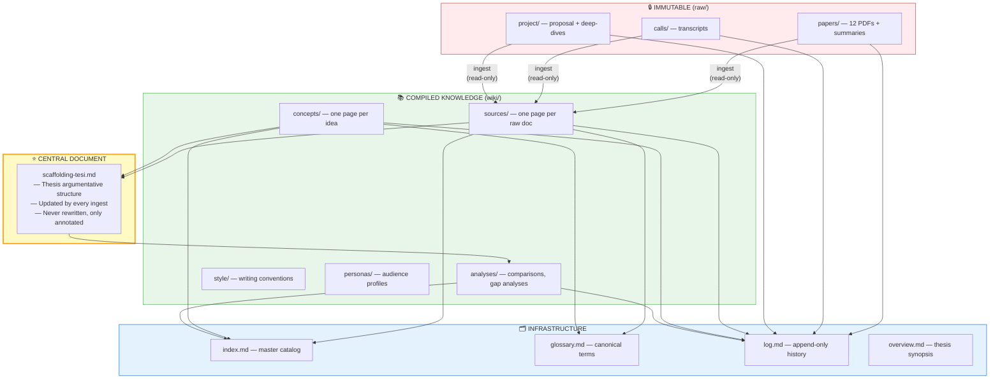

# Information Flow — From New Document to Wiki Memory

## 1. Ingest Flow (Paper / Call / Approfondimento)

```mermaid
flowchart TD
    subgraph INPUT["📥 INPUT — raw/ (immutable)"]
        DOC["New Document\n(PDF, transcript, notes)"]
    end

    subgraph CONTEXT["📖 CONTEXT LOADING"]
        SC["wiki/scaffolding-tesi.md\n(current thesis structure)"]
        GL["wiki/glossary.md\n(canonical terms)"]
        IX["wiki/index.md\n(page catalog)"]
    end

    subgraph DISTILL["🔬 THREE-LAYER DISTILLATION"]
        YT["yt.md\nDivulgative layer\n(YouTube-style explainer)"]
        RI["riassunto.md\nAcademic layer\n(problem → method → results → limits)"]
        VT["Valore per la mia tesi.md\nThesis-contextualised layer\n(the most important file)"]
    end

    subgraph EXTRACT["⚙️ STRUCTURED EXTRACTION"]
        DIM["Structural Dimensions:\n• Supported argument\n• Gap filled\n• Key concepts\n• Tensions\n• Scaffolding position\n(Contributo 1/2/3)"]
        CTX_BLOCK["Fixed Thesis Context Block\n(CDT for 5G, 3 contributions,\n4 agents, evaluation gap)\nprepended to every analysis"]
    end

    subgraph MEMORY["🧠 WIKI MEMORY (wiki/)"]
        SRC["wiki/sources/‹slug›.md\n— Source page created/updated"]
        SCAFF["wiki/scaffolding-tesi.md\n— Annotated with paper contribution\n— Tensions flagged with ⚠️"]
        CONC["wiki/concepts/*.md\n— 0–3 concept pages\ncreated/updated"]
        GLOSS["wiki/glossary.md\n— New canonical terms added\n— Variants flagged"]
        INDEX["wiki/index.md\n— Catalog entry added/updated"]
        LOG["wiki/log.md\n— Append-only entry"]
    end

    DOC --> |"Claude reads\nraw document"| DISTILL
    SC --> |"read first"| DISTILL
    GL --> |"read first"| DISTILL
    IX --> |"read first"| DISTILL
    CTX_BLOCK --> VT

    YT --> SRC
    RI --> SRC
    VT --> EXTRACT
    EXTRACT --> DIM

    DIM --> |"argument supported\ngap filled\nposition in thesis"| SCAFF
    DIM --> |"key concepts\nnew frameworks"| CONC
    DIM --> |"new terms\nvariant conflicts"| GLOSS
    DIM --> |"full source page"| SRC
    SRC --> INDEX
    SRC --> LOG

    SCAFF --> |"⚠️ TENSIONE:\nif contradicts\nexisting content"| SCAFF

    style INPUT fill:#e8f4fd,stroke:#2196F3
    style CONTEXT fill:#fff3e0,stroke:#FF9800
    style DISTILL fill:#f3e5f5,stroke:#9C27B0
    style EXTRACT fill:#fce4ec,stroke:#E91E63
    style MEMORY fill:#e8f5e9,stroke:#4CAF50
```

## 2. Query Flow

```mermaid
flowchart LR
    subgraph IN["❓ USER QUERY"]
        Q["Question about\nthesis or materials"]
    end

    subgraph LOOKUP["🔍 WIKI LOOKUP"]
        IX2["wiki/index.md\n→ identify relevant pages"]
        PAGES["Read matched pages\n+ scaffolding if relevant"]
    end

    subgraph OUT["💬 OUTPUT"]
        ANS["Synthesised answer\nwith [[wiki-page]] citations"]
    end

    subgraph ARCHIVE["📦 OPTIONAL ARCHIVE"]
        AN["wiki/analyses/‹query›.md\n(if user says yes)"]
        LOG2["wiki/log.md\n— query entry appended"]
    end

    Q --> IX2 --> PAGES --> ANS
    ANS --> |"'Archive this?'"| ARCHIVE

    style IN fill:#e8f4fd,stroke:#2196F3
    style LOOKUP fill:#fff3e0,stroke:#FF9800
    style OUT fill:#e8f5e9,stroke:#4CAF50
    style ARCHIVE fill:#f3e5f5,stroke:#9C27B0
```

## 3. Lint Flow (Self-Audit)

```mermaid
flowchart TD
    subgraph SCAN["🔎 FULL WIKI SCAN"]
        ALL["Read all wiki/ pages"]
    end

    subgraph CHECK["⚠️ CHECKS"]
        C1["Contradictions between sources"]
        C2["Unsupported claims in scaffolding"]
        C3["Orphan pages (no inbound links)"]
        C4["Concepts mentioned but no page"]
        C5["Glossary inconsistencies"]
        C6["Incomplete source pages"]
    end

    subgraph ACT["🔧 ACTIONS"]
        FIX["Propose fixes\n→ user approves"]
        LOG3["wiki/log.md\n— lint entry appended"]
    end

    ALL --> C1 & C2 & C3 & C4 & C5 & C6
    C1 & C2 & C3 & C4 & C5 & C6 --> FIX --> LOG3

    style SCAN fill:#e8f4fd,stroke:#2196F3
    style CHECK fill:#fce4ec,stroke:#E91E63
    style ACT fill:#e8f5e9,stroke:#4CAF50
```

## 4. Memory Architecture Summary

```mermaid
flowchart TD
    subgraph IMMUTABLE["🔒 IMMUTABLE (raw/)"]
        P["papers/ — 12 PDFs + summaries"]
        CA["calls/ — transcripts"]
        PR["project/ — proposal + deep-dives"]
    end

    subgraph CENTRAL["⭐ CENTRAL DOCUMENT"]
        S["scaffolding-tesi.md\n— Thesis argumentative structure\n— Updated by every ingest\n— Never rewritten, only annotated"]
    end

    subgraph COMPILED["📚 COMPILED KNOWLEDGE (wiki/)"]
        SRC2["sources/ — one page per raw doc"]
        CON2["concepts/ — one page per idea"]
        ANA2["analyses/ — comparisons, gap analyses"]
        STY2["style/ — writing conventions"]
        PER2["personas/ — audience profiles"]
    end

    subgraph INFRA["🗂️ INFRASTRUCTURE"]
        I2["index.md — master catalog"]
        G2["glossary.md — canonical terms"]
        L2["log.md — append-only history"]
        O2["overview.md — thesis synopsis"]
    end

    P & CA & PR --> |"ingest\n(read-only)"| SRC2
    SRC2 --> S
    CON2 --> S
    S --> ANA2
    SRC2 & CON2 & ANA2 --> I2
    SRC2 & CON2 --> G2
    P & CA & PR & SRC2 & CON2 & ANA2 --> L2

    style IMMUTABLE fill:#ffebee,stroke:#c62828
    style CENTRAL fill:#fff9c4,stroke:#f9a825,stroke-width:3px
    style COMPILED fill:#e8f5e9,stroke:#4CAF50
    style INFRA fill:#e3f2fd,stroke:#1565C0
```
